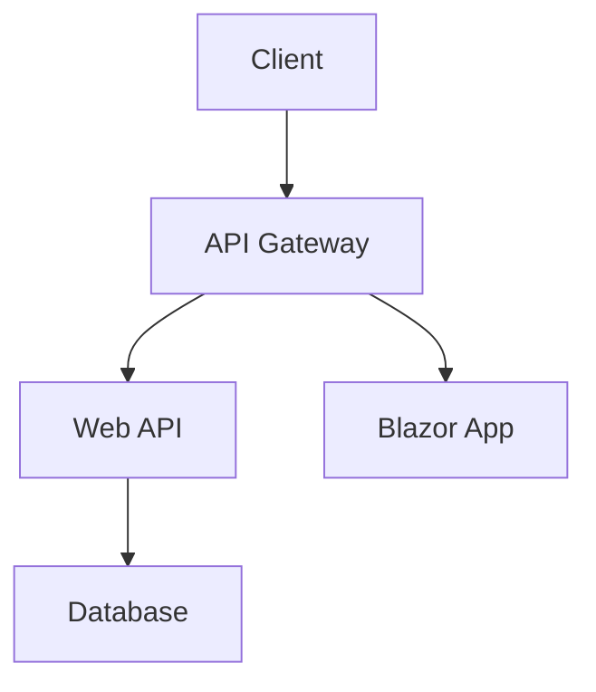
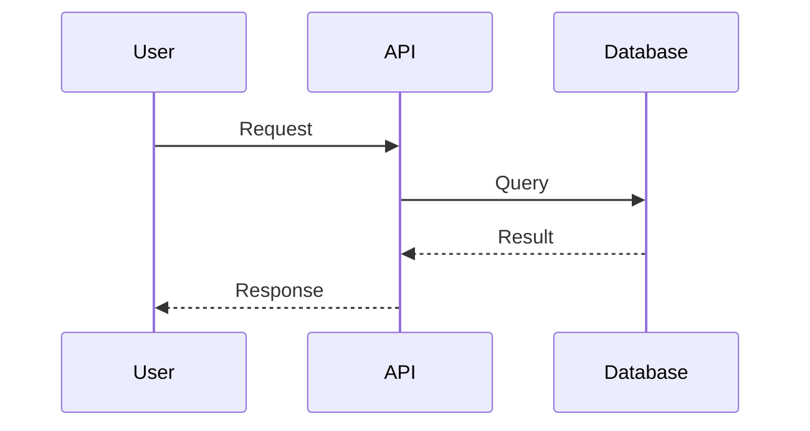

# Documentation Standards

## Overview

This guide provides templates and standards for all project documentation, ensuring consistency, completeness, and maintainability across all documentation types.

## Repository Documentation Structure

```
/
├── docs/
│   ├── requirements/
│   │   ├── BUSINESS_REQUIREMENTS.md
│   │   ├── FUNCTIONAL_REQUIREMENTS.md
│   │   ├── NON_FUNCTIONAL_REQUIREMENTS.md
│   │   ├── USER_STORIES.md
│   │   └── CONSTRAINTS_AND_ASSUMPTIONS.md
│   ├── architecture/
│   │   ├── SYSTEM_ARCHITECTURE.md
│   │   ├── DATA_ARCHITECTURE.md
│   │   ├── SECURITY_ARCHITECTURE.md
│   │   ├── FRONTEND_ARCHITECTURE.md
│   │   ├── OBSERVABILITY_ARCHITECTURE.md
│   │   ├── DEPLOYMENT_ARCHITECTURE.md
│   │   ├── decisions/           # ADRs
│   │   │   ├── ADR-001-title.md
│   │   │   ├── ADR-002-title.md
│   │   │   └── README.md        # ADR index
│   │   └── diagrams/
│   │       ├── system-context.mmd
│   │       ├── container-diagram.mmd
│   │       ├── component-diagram.mmd
│   │       ├── auth-flow.mmd
│   │       └── data-flow.mmd
│   ├── api/
│   │   ├── README.md            # API overview
│   │   ├── authentication.md
│   │   ├── endpoints/
│   │   │   ├── users.md
│   │   │   ├── orders.md
│   │   │   └── products.md
│   │   └── openapi.yaml         # OpenAPI specification
│   ├── features/
│   │   ├── feature-001-user-auth-plan.md
│   │   ├── feature-002-order-management-plan.md
│   │   └── README.md            # Feature index
│   ├── operations/
│   │   ├── MONITORING_STRATEGY.md
│   │   ├── ALERT_DEFINITIONS.md
│   │   ├── CICD_PIPELINE.md
│   │   ├── INFRASTRUCTURE_SETUP.md
│   │   ├── ENVIRONMENT_CONFIGURATION.md
│   │   ├── PRODUCTION_READINESS_CHECKLIST.md
│   │   ├── PRODUCTION_DEPLOYMENT_PLAN.md
│   │   ├── runbooks/
│   │   │   ├── deployment-runbook.md
│   │   │   ├── incident-response-runbook.md
│   │   │   ├── database-migration-runbook.md
│   │   │   └── troubleshooting-guide.md
│   │   └── post-mortems/
│   │       ├── 2024-01-15-incident-001.md
│   │       └── template.md
│   ├── development/
│   │   ├── DEVELOPMENT_SETUP.md
│   │   ├── CODING_STANDARDS.md
│   │   ├── TESTING_STRATEGY.md
│   │   └── TROUBLESHOOTING.md
│   ├── user-guide/
│   │   ├── README.md
│   │   ├── getting-started.md
│   │   ├── feature-guides/
│   │   └── faq.md
│   ├── security/
│   │   ├── THREAT_MODEL.md
│   │   ├── SECRETS_MANAGEMENT.md
│   │   └── SECURITY_TESTING.md
│   └── DEVELOPMENT_LEDGER.md
├── README.md
├── CONTRIBUTING.md
├── CHANGELOG.md
├── CODE_OF_CONDUCT.md
├── SECURITY.md
└── LICENSE
```

## Core Repository Documents

### README.md

```markdown
# Project Name

Brief description of what this project does and why it exists (1-2 sentences).

[](link)
[](link)
[](link)

## Overview

More detailed description of the project (2-3 paragraphs):
- What problem does it solve?
- Who is it for?
- What makes it unique?

## Features

- Key feature 1 with brief description
- Key feature 2 with brief description
- Key feature 3 with brief description

## Architecture

Brief architecture overview with link to detailed documentation.



See [Architecture Documentation](docs/architecture/SYSTEM_ARCHITECTURE.md) for details.

## Prerequisites

- .NET 8.0 SDK or later
- SQL Server 2019+ or Azure SQL Database
- Visual Studio 2022 / Rider / VS Code
- Azure subscription (for deployment)
- [Any other prerequisites]

## Getting Started

### Quick Start

```bash
# Clone the repository
git clone https://github.com/org/repo.git
cd repo

# Restore dependencies
dotnet restore

# Set up user secrets (first time only)
dotnet user-secrets init --project src/ProjectName.API
dotnet user-secrets set "ConnectionStrings:DefaultConnection" "your-connection-string" --project src/ProjectName.API

# Run database migrations
dotnet ef database update --project src/ProjectName.Infrastructure --startup-project src/ProjectName.API

# Run the application
dotnet run --project src/ProjectName.API
```

Navigate to `https://localhost:5001`

### Detailed Setup

See [Development Setup Guide](docs/development/DEVELOPMENT_SETUP.md) for detailed instructions.

## Configuration

Key configuration settings:

- **Database**: Configure connection string in User Secrets or Azure App Configuration
- **Authentication**: Configure identity provider settings
- **Logging**: Application Insights instrumentation key
- **Cache**: Redis connection string (if using distributed cache)

See [Environment Configuration](docs/operations/ENVIRONMENT_CONFIGURATION.md) for all configuration options.

## Usage

### API Usage

```csharp
// Example API call
var client = new HttpClient();
var response = await client.PostAsJsonAsync(
    "https://api.example.com/api/orders",
    new CreateOrderRequest { CustomerId = 123, Items = [...] }
);
```

See [API Documentation](docs/api/README.md) for complete API reference.

### Running Tests

```bash
# Run all tests
dotnet test

# Run unit tests only
dotnet test --filter Category=Unit

# Run with coverage
dotnet test /p:CollectCoverage=true
```

## Project Structure

```
src/
├── ProjectName.API/          # Web API project
├── ProjectName.Core/         # Domain models and interfaces
├── ProjectName.Infrastructure/ # Data access and external services
└── ProjectName.Web/          # Blazor web application (if applicable)

tests/
├── ProjectName.UnitTests/
├── ProjectName.IntegrationTests/
└── ProjectName.E2ETests/
```

## Documentation

- [Architecture Documentation](docs/architecture/)
- [API Documentation](docs/api/)
- [Development Guide](docs/development/)
- [Operations Guide](docs/operations/)
- [User Guide](docs/user-guide/)

## Contributing

We welcome contributions! Please see [CONTRIBUTING.md](CONTRIBUTING.md) for guidelines.

## Deployment

See [Deployment Guide](docs/operations/PRODUCTION_DEPLOYMENT_PLAN.md) for deployment instructions.

## Support

- **Documentation**: [docs/](docs/)
- **Issues**: [GitHub Issues](https://github.com/org/repo/issues)
- **Email**: <support@example.com>
- **Teams Channel**: [Link to Teams channel]

## License

This project is licensed under the [License Name] - see [LICENSE](LICENSE) file for details.

## Changelog

See [CHANGELOG.md](CHANGELOG.md) for release history.

## Team

- **Product Owner**: [Name]
- **Technical Lead**: [Name]
- **Development Team**: [Names or link to team page]

## Acknowledgments

- [Any acknowledgments, third-party libraries, inspirations]

```

### CONTRIBUTING.md

```markdown
# Contributing to [Project Name]

Thank you for your interest in contributing! This document provides guidelines and instructions for contributing to this project.

## Table of Contents

- [Code of Conduct](#code-of-conduct)
- [Getting Started](#getting-started)
- [Development Workflow](#development-workflow)
- [Coding Standards](#coding-standards)
- [Commit Messages](#commit-messages)
- [Pull Request Process](#pull-request-process)
- [Testing Guidelines](#testing-guidelines)
- [Documentation](#documentation)

## Code of Conduct

This project follows our [Code of Conduct](CODE_OF_CONDUCT.md). By participating, you are expected to uphold this code.

## Getting Started

1. **Fork the repository** and clone your fork
2. **Set up your development environment** following [Development Setup](docs/development/DEVELOPMENT_SETUP.md)
3. **Create a branch** from `main` for your work
4. **Make your changes** following our coding standards
5. **Test your changes** thoroughly
6. **Submit a pull request**

## Development Workflow

### Branch Naming Convention

- `feature/[ticket-number]-brief-description` - For new features
- `bugfix/[ticket-number]-brief-description` - For bug fixes
- `hotfix/[ticket-number]-brief-description` - For urgent production fixes
- `docs/brief-description` - For documentation changes
- `refactor/brief-description` - For refactoring work

Examples:
- `feature/123-add-user-authentication`
- `bugfix/456-fix-order-calculation`
- `docs/update-api-documentation`

### Development Process

1. **Sync with main**
   ```bash
   git checkout main
   git pull upstream main
   ```

2. **Create your branch**

   ```bash
   git checkout -b feature/123-your-feature
   ```

3. **Make changes and commit**

   ```bash
   git add .
   git commit -m "feat: add user authentication"
   ```

4. **Keep your branch updated**

   ```bash
   git fetch upstream
   git rebase upstream/main
   ```

5. **Push your branch**

   ```bash
   git push origin feature/123-your-feature
   ```

6. **Create Pull Request** on GitHub/Azure DevOps

## Coding Standards

### C# Style Guide

We follow [Microsoft's C# Coding Conventions](https://docs.microsoft.com/en-us/dotnet/csharp/fundamentals/coding-style/coding-conventions) with these additions:

**Naming Conventions**:

- `PascalCase` for class names, method names, properties, constants
- `camelCase` for local variables, parameters, private fields
- `_camelCase` for private fields (with underscore prefix)
- `IPascalCase` for interfaces (with "I" prefix)

**Code Organization**:

- Maximum 300 lines per file (split if larger)
- Maximum 50 lines per method
- One class per file (except nested classes)
- Group members: fields, constructors, properties, methods

**Best Practices**:

- Use nullable reference types (`#nullable enable`)
- Prefer `var` for obvious types
- Use `async`/`await` for I/O operations
- Use dependency injection for dependencies
- Keep methods focused (single responsibility)
- Avoid premature optimization

### Code Quality

- **No compiler warnings** - All warnings must be addressed
- **80%+ test coverage** - Aim for high test coverage
- **Static analysis** - Code must pass all enabled analyzers
- **Security** - Follow security best practices (see [Security Guide](docs/security/))

## Commit Messages

We use [Conventional Commits](https://www.conventionalcommits.org/):

**Format**:

```
<type>(<scope>): <subject>

<body>

<footer>
```

**Types**:

- `feat`: New feature
- `fix`: Bug fix
- `docs`: Documentation changes
- `style`: Code style changes (formatting, no logic change)
- `refactor`: Refactoring (no feature or fix)
- `perf`: Performance improvements
- `test`: Adding or updating tests
- `chore`: Maintenance tasks, dependency updates
- `ci`: CI/CD changes

**Examples**:

```
feat(auth): add JWT token refresh endpoint

Implement automatic token refresh to improve user experience.
Token refresh happens 5 minutes before expiration.

Closes #123
```

```
fix(orders): correct order total calculation

Fixed rounding error in order total when applying discounts.

Fixes #456
```

**Guidelines**:

- Use imperative mood ("add" not "added")
- Keep subject line under 50 characters
- Wrap body at 72 characters
- Reference issues and PRs in footer

## Pull Request Process

### Before Creating PR

- [ ] Code follows coding standards
- [ ] All tests pass locally
- [ ] New tests added for new functionality
- [ ] Documentation updated (if needed)
- [ ] No merge conflicts with main
- [ ] Commits are clean and follow commit message conventions

### Creating PR

1. **Use PR template** - Fill out all sections
2. **Link work items** - Reference related issues/tickets
3. **Add reviewers** - Add at least 2 reviewers
4. **Add labels** - Add appropriate labels (feature, bug, etc.)
5. **Request review** - Notify reviewers

### PR Title Format

Use conventional commit format for PR titles:

```
feat(scope): brief description
fix(scope): brief description
```

### PR Description Template

```markdown
## Description
Brief description of changes

## Type of Change
- [ ] Bug fix
- [ ] New feature
- [ ] Breaking change
- [ ] Documentation update

## Related Issues
Closes #[issue number]
Related to #[issue number]

## Changes Made
- Change 1
- Change 2
- Change 3

## Testing
- [ ] Unit tests added/updated
- [ ] Integration tests added/updated
- [ ] Manual testing completed
- [ ] All tests passing

## Screenshots (if applicable)
[Add screenshots]

## Checklist
- [ ] Code follows style guidelines
- [ ] Self-review completed
- [ ] Comments added for complex code
- [ ] Documentation updated
- [ ] No new warnings
- [ ] Tests added and passing
- [ ] Development Ledger updated

## Reviewer Notes
Any specific areas for reviewers to focus on
```

### Review Process

**Reviewers should check**:

- Code quality and standards compliance
- Test coverage and test quality
- Security considerations
- Performance implications
- Documentation completeness
- Architecture alignment

**Review Timeline**:

- Small PRs (<100 lines): 1 business day
- Medium PRs (100-500 lines): 2 business days
- Large PRs (>500 lines): 3 business days
  - Consider breaking large PRs into smaller ones

### Merging

**Requirements**:

- [ ] Minimum 1 approval (2 for breaking changes)
- [ ] All checks passing (build, tests, quality gates)
- [ ] No merge conflicts
- [ ] Reviewer comments addressed
- [ ] Documentation updated

**Merge Strategy**:

- Use "Squash and merge" for feature branches
- Maintain clean commit history on main
- Delete branch after merge

## Testing Guidelines

### Test Requirements

All code changes must include appropriate tests:

**Unit Tests**:

- Test business logic
- Test validation rules
- Mock external dependencies
- Aim for 80%+ coverage

**Integration Tests**:

- Test API endpoints
- Test database operations
- Test external integrations
- Use test containers when possible

**E2E Tests** (for critical paths):

- Test complete user workflows
- Test happy path and error scenarios
- Run against test environment

### Running Tests

```bash
# Run all tests
dotnet test

# Run specific test category
dotnet test --filter Category=Unit

# Run with coverage
dotnet test /p:CollectCoverage=true /p:CoverletOutputFormat=opencover

# Run specific test
dotnet test --filter "FullyQualifiedName~Namespace.ClassName.MethodName"
```

### Test Naming Convention

```csharp
[Fact]
public void MethodName_Scenario_ExpectedBehavior()
{
    // Arrange
    
    // Act
    
    // Assert
}
```

Example:

```csharp
[Fact]
public void CreateOrder_WithInvalidCustomer_ThrowsValidationException()
```

## Documentation

### Documentation Requirements

- **Code comments**: Document complex logic, non-obvious decisions
- **XML documentation**: For all public APIs
- **README updates**: Update if adding features or changing setup
- **API documentation**: Update OpenAPI/Swagger specs
- **Architecture docs**: Update if changing architecture
- **Runbooks**: Update operational procedures if needed

### Documentation Style

- Use clear, concise language
- Include examples where helpful
- Keep documentation close to code
- Update docs in same PR as code changes

## Questions?

If you have questions:

- Check existing documentation in [docs/](docs/)
- Ask in [Teams channel / Slack]
- Create a discussion in GitHub
- Contact: [maintainer email]

## Recognition

Contributors are recognized in:

- Pull request acknowledgments
- Release notes
- [Contributors file](CONTRIBUTORS.md) (if applicable)

Thank you for contributing! 🎉

```

### CHANGELOG.md

```markdown
# Changelog

All notable changes to this project will be documented in this file.

The format is based on [Keep a Changelog](https://keepachangelog.com/en/1.0.0/),
and this project adheres to [Semantic Versioning](https://semver.org/spec/v2.0.0.html).

## [Unreleased]

### Added
- Features added but not yet released

### Changed
- Changes in existing functionality

### Deprecated
- Features soon to be removed

### Removed
- Features removed

### Fixed
- Bug fixes

### Security
- Security fixes

## [1.0.0] - 2024-01-25

### Added
- Initial release
- User authentication with Azure AD B2C
- Order management API
- Customer portal (Blazor Server)
- Admin dashboard
- Real-time notifications with SignalR
- Comprehensive monitoring with Application Insights
- CI/CD pipeline with Azure DevOps

### Changed
- N/A (initial release)

### Security
- Implemented HTTPS enforcement
- Added rate limiting to all API endpoints
- Configured Azure Key Vault for secrets management

## [0.9.0] - 2024-01-15 (Beta)

### Added
- Beta release for UAT
- Core API functionality
- Basic UI components

### Known Issues
- Performance optimization pending for large order lists
- Mobile responsiveness needs improvement

## [0.1.0] - 2023-12-01 (Alpha)

### Added
- Initial alpha release
- Basic project structure
- Proof of concept features

---

## Version Format

We use [Semantic Versioning](https://semver.org/):
- **MAJOR**: Incompatible API changes
- **MINOR**: New functionality (backwards compatible)
- **PATCH**: Bug fixes (backwards compatible)

## Change Categories

- **Added**: New features
- **Changed**: Changes in existing functionality
- **Deprecated**: Soon-to-be removed features
- **Removed**: Removed features
- **Fixed**: Bug fixes
- **Security**: Security-related changes

[Unreleased]: https://github.com/org/repo/compare/v1.0.0...HEAD
[1.0.0]: https://github.com/org/repo/compare/v0.9.0...v1.0.0
[0.9.0]: https://github.com/org/repo/compare/v0.1.0...v0.9.0
[0.1.0]: https://github.com/org/repo/releases/tag/v0.1.0
```

### SECURITY.md

```markdown
# Security Policy

## Supported Versions

We release patches for security vulnerabilities in the following versions:

| Version | Supported          |
| ------- | ------------------ |
| 1.x.x   | :white_check_mark: |
| < 1.0   | :x:                |

## Reporting a Vulnerability

**Please do not report security vulnerabilities through public GitHub issues.**

### How to Report

If you discover a security vulnerability, please send an email to:

**security@example.com**

Include the following information:
- Type of vulnerability
- Full paths of source file(s) related to the vulnerability
- Location of the affected source code (tag/branch/commit or URL)
- Step-by-step instructions to reproduce the issue
- Proof-of-concept or exploit code (if possible)
- Impact of the issue, including how an attacker might exploit it

### What to Expect

- **Acknowledgment**: Within 48 hours of your report
- **Initial Assessment**: Within 5 business days
- **Regular Updates**: At least every 5 business days
- **Resolution Timeline**: We aim to resolve critical issues within 30 days

### Disclosure Policy

- We request that you give us reasonable time to investigate and fix the issue before public disclosure
- We will acknowledge your contribution in the security advisory (unless you prefer to remain anonymous)
- We follow coordinated disclosure practices

## Security Best Practices

### For Users

- Keep your dependencies up to date
- Use strong, unique passwords
- Enable multi-factor authentication
- Review audit logs regularly
- Follow the principle of least privilege

### For Contributors

- Never commit secrets, API keys, or credentials
- Use parameterized queries to prevent SQL injection
- Validate and sanitize all user inputs
- Use HTTPS for all communications
- Follow our [Security Coding Guidelines](docs/security/)

## Security Features

This application includes:

- **Authentication**: Azure AD B2C / JWT tokens
- **Authorization**: Role-based and policy-based access control
- **Data Protection**: Encryption at rest and in transit
- **Input Validation**: Comprehensive input validation and sanitization
- **Rate Limiting**: API rate limiting to prevent abuse
- **Security Headers**: HSTS, CSP, X-Frame-Options, etc.
- **Secrets Management**: Azure Key Vault integration
- **Audit Logging**: Comprehensive security event logging

## Vulnerability Disclosure

When a security vulnerability is confirmed, we will:

1. Develop and test a fix
2. Release a security update
3. Publish a security advisory on GitHub
4. Update this document with remediation guidance
5. Notify affected users (if applicable)

## Security Updates

Subscribe to security updates:
- Watch this repository for security advisories
- Subscribe to our security mailing list: security-announce@example.com

## Hall of Fame

We recognize security researchers who responsibly disclose vulnerabilities:

[List of acknowledged security researchers]

## Contact

For security concerns: security@example.com
For general questions: support@example.com

---

Last Updated: [Date]
```

## Architecture Decision Records (ADRs)

### ADR Template

Create each ADR as: `/docs/architecture/decisions/ADR-###-title.md`

```markdown
# ADR-### : [Title of Decision]

## Status

[Proposed | Accepted | Deprecated | Superseded by ADR-XXX]

**Date**: YYYY-MM-DD

**Deciders**: [List of people involved in the decision]

## Context

[Describe the context and problem statement. What decision needs to be made and why?]

### Problem Statement

[Clear statement of the problem or question that needs to be addressed]

### Driving Forces

[Factors influencing the decision:]
- Technical constraints
- Business requirements
- Team capabilities
- Timeline pressures
- Cost considerations

## Decision

[The decision that was made. State clearly and concisely.]

## Alternatives Considered

### Alternative 1: [Name]

**Description**: [Brief description of the alternative]

**Pros**:
- Pro 1
- Pro 2

**Cons**:
- Con 1
- Con 2

**Cost/Effort**: [Estimate if applicable]

### Alternative 2: [Name]

[Same structure as Alternative 1]

### Alternative 3: [Name]

[Same structure as Alternative 1]

## Comparison Matrix

| Criteria | Selected Decision | Alternative 1 | Alternative 2 |
|----------|------------------|---------------|---------------|
| Performance | High | Medium | Low |
| Complexity | Medium | High | Low |
| Cost | $$ | $ | $$$ |
| Team Familiarity | High | Low | Medium |
| Maintainability | High | Medium | Low |

## Consequences

### Positive Consequences

- [Benefit 1]
- [Benefit 2]
- [Benefit 3]

### Negative Consequences

- [Trade-off 1]
- [Trade-off 2]
- [Trade-off 3]

### Risks and Mitigation

| Risk | Impact | Probability | Mitigation |
|------|--------|-------------|------------|
| [Risk 1] | High/Medium/Low | High/Medium/Low | [How to mitigate] |
| [Risk 2] | High/Medium/Low | High/Medium/Low | [How to mitigate] |

## Implementation Notes

[Specific notes about implementing this decision:]
- Dependencies that need to be installed
- Configuration changes required
- Migration steps if changing from something else
- Testing considerations

## Validation

[How will we know this decision was correct?]
- Success metrics
- Performance benchmarks
- User satisfaction indicators

## Related Decisions

- [Link to related ADR-XXX]
- [Link to related ADR-YYY]

## References

- [Link to external documentation]
- [Link to research or articles]
- [Link to prototypes or POCs]

## Notes

[Any additional notes, learnings, or context]

## Revision History

| Date | Author | Changes |
|------|--------|---------|
| YYYY-MM-DD | [Name] | Initial version |
| YYYY-MM-DD | [Name] | Updated based on implementation learnings |
```

### ADR Index

Create: `/docs/architecture/decisions/README.md`

```markdown
# Architecture Decision Records

This directory contains Architecture Decision Records (ADRs) for [Project Name].

## What is an ADR?

An ADR is a document that captures an important architectural decision made along with its context and consequences.

## ADR List

### Active

- [ADR-001: Use Blazor Server for Web Application](ADR-001-blazor-server.md) - 2024-01-10
- [ADR-002: Implement CQRS Pattern for Order Processing](ADR-002-cqrs-orders.md) - 2024-01-12
- [ADR-003: Use Azure SQL Database](ADR-003-azure-sql.md) - 2024-01-15
- [ADR-004: Deploy to Azure App Service](ADR-004-azure-app-service.md) - 2024-01-18
- [ADR-005: Use Azure AD B2C for Authentication](ADR-005-azure-ad-b2c.md) - 2024-01-20

### Superseded

- [ADR-999: Initial Database Choice](ADR-999-initial-database.md) - Superseded by ADR-003

### Deprecated

- None currently

## Creating a New ADR

1. Copy the [ADR template](template.md)
2. Number it sequentially (next available number)
3. Use format: `ADR-###-brief-title.md`
4. Fill out all sections
5. Submit for review via pull request
6. Update this index when merged

## ADR Workflow

1. **Proposed**: Initial ADR created and under discussion
2. **Accepted**: ADR approved and decision is active
3. **Deprecated**: Decision no longer recommended but still in use
4. **Superseded**: Decision replaced by a newer ADR

## Questions?

If you have questions about ADRs or a specific decision, contact the architecture team or open a discussion.
```

## Feature Plan Template

Create each feature plan as: `/docs/features/[FEATURE-NAME]-plan.md`

```markdown
# Feature: [Feature Name]

## Status

[Planned | In Progress | In Review | Completed | Deferred | Cancelled]

**Last Updated**: YYYY-MM-DD

## Overview

[Brief 2-3 sentence description of the feature and its purpose]

## Business Value

[Why are we building this? What business problem does it solve?]

### Success Metrics

- [Metric 1]: [Target value]
- [Metric 2]: [Target value]
- [Metric 3]: [Target value]

## Requirements

### User Stories

- Link to user story 1: [link]
- Link to user story 2: [link]

### Functional Requirements

1. [Requirement 1]
2. [Requirement 2]
3. [Requirement 3]

### Non-Functional Requirements

- **Performance**: [specific targets, e.g., < 200ms response time]
- **Security**: [security requirements]
- **Accessibility**: [WCAG level required]
- **Scalability**: [expected load]
- **Availability**: [uptime requirements]

### Acceptance Criteria

- [ ] [Criterion 1]
- [ ] [Criterion 2]
- [ ] [Criterion 3]

## Architecture

### System Components Affected

- [Component 1]: [How it's affected]
- [Component 2]: [How it's affected]

### Design Decisions

#### Decision 1: [Title]

- **Context**: [Why this decision was needed]
- **Decision**: [What was decided]
- **Alternatives**: [What else was considered]
- **Rationale**: [Why this choice]
- **Related ADR**: [Link to ADR if created]

#### Decision 2: [Title]

[Same structure]

### Architecture Diagrams

[Include or link to relevant diagrams]



### API Changes

**New Endpoints**:

- `POST /api/resource` - Create new resource
- `GET /api/resource/{id}` - Get resource by ID

**Modified Endpoints**:

- `PUT /api/existing/{id}` - Added new field `fieldName`

**Deprecated Endpoints**:

- `GET /api/old-endpoint` - Use `/api/new-endpoint` instead

### Data Model Changes

**New Entities**:

- `EntityName` - Description of entity

**Modified Entities**:

- `ExistingEntity.NewProperty` - Description of new property

**Database Migrations**:

- Migration: `20240125_AddNewEntity`
- Breaking changes: [Yes/No] - [Details if yes]

## Implementation Plan

### Backend Tasks

- [ ] **Task 1**: [Description] - Assigned: [Name] - Estimate: [hours/points]
- [ ] **Task 2**: [Description] - Assigned: [Name] - Estimate: [hours/points]
- [ ] **Task 3**: [Description] - Assigned: [Name] - Estimate: [hours/points]

### Frontend Tasks (if applicable)

- [ ] **Task 1**: [Description] - Assigned: [Name] - Estimate: [hours/points]
- [ ] **Task 2**: [Description] - Assigned: [Name] - Estimate: [hours/points]

### Database Tasks

- [ ] **Task 1**: Create migration - Assigned: [Name] - Estimate: [hours]
- [ ] **Task 2**: Test migration rollback - Assigned: [Name] - Estimate: [hours]

### Testing Tasks

- [ ] **Unit Tests**: [Component/Service to test]
- [ ] **Integration Tests**: [Integration scenario to test]
- [ ] **E2E Tests**: [User workflow to test]
- [ ] **Performance Tests**: [Performance scenario to test]
- [ ] **Security Tests**: [Security aspect to test]
- [ ] **Accessibility Tests**: [Accessibility requirement to verify]

### Documentation Tasks

- [ ] **API Documentation**: Update OpenAPI spec
- [ ] **User Guide**: Create/update user documentation
- [ ] **Architecture Docs**: Update architecture documentation
- [ ] **Runbook**: Create operational runbook (if needed)
- [ ] **Code Comments**: Ensure code is well-documented

## Technical Specifications

### API Endpoint Specifications

#### POST /api/resource

**Request**:

```json
{
  "field1": "string",
  "field2": 123,
  "field3": true
}
```

**Response (201 Created)**:

```json
{
  "id": "guid",
  "field1": "string",
  "field2": 123,
  "field3": true,
  "createdAt": "2024-01-25T10:00:00Z"
}
```

**Errors**:

- `400 Bad Request`: Invalid input
- `401 Unauthorized`: Not authenticated
- `403 Forbidden`: Insufficient permissions

### Data Model

```csharp
public class EntityName
{
    public Guid Id { get; set; }
    public string Field1 { get; set; }
    public int Field2 { get; set; }
    public bool Field3 { get; set; }
    public DateTime CreatedAt { get; set; }
    public DateTime UpdatedAt { get; set; }
}
```

### Business Logic

[Describe key business rules and validation logic]

1. Rule 1: [Description]
2. Rule 2: [Description]
3. Rule 3: [Description]

## Dependencies

### External Dependencies

- [Dependency 1]: [Why needed, version if applicable]
- [Dependency 2]: [Why needed, version if applicable]

### Internal Dependencies

- **Feature/Service Dependencies**: [Other features this depends on]
- **Data Dependencies**: [Data that must exist first]
- **Infrastructure Dependencies**: [Infrastructure requirements]

### Blocking Issues

- [Issue 1]: [Description and status]
- [Issue 2]: [Description and status]

### This Feature Blocks

- [Feature 1]: [Why it blocks]
- [Feature 2]: [Why it blocks]

## Testing Strategy

### Unit Testing

**Coverage Target**: 80%+

**Focus Areas**:

- Business logic validation
- Input validation
- Error handling
- Edge cases

### Integration Testing

**Test Scenarios**:

### E2E Testing

**User Workflows**:

### Performance Testing

**Scenarios**:

- Load: [X] concurrent users
- Response time: < [Y]ms
- Throughput: [Z] requests/second

**Acceptance Criteria**:

- [ ] All performance targets met
- [ ] No memory leaks detected
- [ ] Database queries optimized

### Security Testing

**Areas to Test**:

- [ ] Input validation
- [ ] Authentication/authorization
- [ ] SQL injection prevention
- [ ] XSS prevention
- [ ] CSRF protection

### Accessibility Testing

**WCAG Level**: [A/AA/AAA]

**Testing Approach**:

- [ ] Automated testing with axe-core
- [ ] Keyboard navigation testing
- [ ] Screen reader testing
- [ ] Color contrast validation

## Deployment Plan

### Pre-Deployment

- [ ] Code review completed
- [ ] All tests passing
- [ ] Documentation updated
- [ ] Security review completed
- [ ] Performance validation completed

### Database Migration Strategy

**Migration Type**: [Additive / Breaking / Data Migration]

**Steps**:

1. [Step 1]
2. [Step 2]
3. [Step 3]

**Rollback Plan**:

1. [Rollback step 1]
2. [Rollback step 2]

### Configuration Changes

**New Settings**:

- `Setting.Name`: [Description, default value]

**Modified Settings**:

- `Existing.Setting`: [What changed]

### Feature Flags

**Feature Flag**: `feature.new-feature-name`

**Rollout Strategy**:

- Internal testing: [Date range]
- Beta users (10%): [Date range]
- Gradual rollout (50%): [Date range]
- Full rollout (100%): [Date range]

### Deployment Order

1. **Test Environment**: [Date]
   - Full testing
   - QA sign-off required

2. **Staging Environment**: [Date]
   - UAT
   - Performance testing
   - Security testing

3. **Production Environment**: [Date]
   - Deployment window: [Time range]
   - Rollback criteria: [Criteria]

### Post-Deployment Validation

- [ ] Smoke tests passed
- [ ] Health checks passing
- [ ] Monitoring shows normal metrics
- [ ] No increase in error rate
- [ ] Performance within targets

### Monitoring

**Key Metrics to Monitor**:

- [Metric 1]: [Expected value]
- [Metric 2]: [Expected value]
- [Metric 3]: [Expected value]

**Alert Thresholds**:

## Risks & Mitigation

### Risk 1: [Title]

- **Probability**: High/Medium/Low
- **Impact**: High/Medium/Low
- **Description**: [Description of risk]
- **Mitigation**: [How to mitigate]
- **Contingency**: [What to do if risk occurs]

### Risk 2: [Title]

[Same structure]

## Open Questions

- [ ] [Question 1] - Owner: [Name] - Due: [Date]
- [ ] [Question 2] - Owner: [Name] - Due: [Date]

## Timeline

| Milestone | Target Date | Status |
|-----------|-------------|--------|
| Feature plan approved | YYYY-MM-DD | Complete |
| Development started | YYYY-MM-DD | In Progress |
| Development complete | YYYY-MM-DD | Planned |
| Testing complete | YYYY-MM-DD | Planned |
| Deployed to Test | YYYY-MM-DD | Planned |
| Deployed to Staging | YYYY-MM-DD | Planned |
| Deployed to Production | YYYY-MM-DD | Planned |

## Success Criteria

- [ ] All acceptance criteria met
- [ ] All tests passing with required coverage
- [ ] Performance targets met
- [ ] Security review passed
- [ ] Accessibility requirements met
- [ ] Documentation complete
- [ ] Deployed to production
- [ ] Monitoring shows healthy metrics
- [ ] No critical incidents in first 48 hours

## Notes

[Any additional notes, considerations, or context]

## Revision History

| Date | Author | Changes |
|------|--------|---------|
| YYYY-MM-DD | [Name] | Initial version |
| YYYY-MM-DD | [Name] | Updated based on review feedback |

```

## Pull Request Template

Create: `.github/PULL_REQUEST_TEMPLATE.md` or Azure DevOps equivalent

```markdown
## Description

[Provide a brief description of the changes in this PR]

## Type of Change

- [ ] Bug fix (non-breaking change which fixes an issue)
- [ ] New feature (non-breaking change which adds functionality)
- [ ] Breaking change (fix or feature that would cause existing functionality to not work as expected)
- [ ] Documentation update
- [ ] Performance improvement
- [ ] Code refactoring
- [ ] CI/CD changes

## Related Issues

Closes #[issue number]
Related to #[issue number]
Part of Epic #[epic number]

## Changes Made

### Backend Changes
- [Change 1]
- [Change 2]

### Frontend Changes (if applicable)
- [Change 1]
- [Change 2]

### Database Changes (if applicable)
- [Migration: name] - [Description]
- [Schema changes]

### Configuration Changes
- [New/modified settings]

## Testing

### Unit Tests
- [ ] Unit tests added for new functionality
- [ ] Existing unit tests updated
- [ ] All unit tests passing
- [ ] Coverage: [percentage]% (target: 80%+)

### Integration Tests
- [ ] Integration tests added/updated
- [ ] All integration tests passing

### E2E Tests (if applicable)
- [ ] E2E tests added/updated
- [ ] All E2E tests passing

### Manual Testing
- [ ] Tested locally
- [ ] Tested in Test environment
- [ ] Edge cases tested
- [ ] Error scenarios tested

Tested scenarios:
1. [Scenario 1]: [Result]
2. [Scenario 2]: [Result]

## Security

- [ ] Input validation implemented
- [ ] Authentication/authorization verified
- [ ] Sensitive data protected
- [ ] Security best practices followed
- [ ] No secrets in code or config
- [ ] Security testing completed (if applicable)

## Performance

- [ ] Performance impact assessed
- [ ] No performance degradation
- [ ] Performance improvements (if applicable): [details]
- [ ] Database queries optimized
- [ ] Caching implemented where appropriate

## Accessibility (if UI changes)

- [ ] WCAG [A/AA/AAA] compliance verified
- [ ] Keyboard navigation tested
- [ ] Screen reader tested
- [ ] Color contrast validated
- [ ] Focus management correct

## Quality Checks

- [ ] Code follows style guidelines
- [ ] Self-review completed
- [ ] Comments added for complex code
- [ ] No compiler warnings
- [ ] Static analysis passed
- [ ] Code review checklist completed

## Documentation

- [ ] Code documented (XML docs, inline comments)
- [ ] API documentation updated (if API changes)
- [ ] Architecture documentation updated (if architecture changes)
- [ ] User documentation updated (if user-facing changes)
- [ ] README updated (if setup/config changes)
- [ ] CHANGELOG.md updated
- [ ] Development Ledger updated
- [ ] Runbooks updated (if operational changes)

## Database Migrations (if applicable)

- [ ] Migration created
- [ ] Migration tested locally
- [ ] Migration tested in Test environment
- [ ] Rollback tested
- [ ] Migration documented
- [ ] Data migration plan documented (if data migration)

## Deployment

- [ ] Deployment plan documented (if special deployment needed)
- [ ] Feature flags configured (if applicable)
- [ ] Configuration changes documented
- [ ] Rollback plan documented
- [ ] Post-deployment validation plan documented

## Breaking Changes

- [ ] No breaking changes
- [ ] Breaking changes documented below:

[If breaking changes, describe them and the migration path]

## Screenshots (if applicable)

### Before
[Screenshot]

### After
[Screenshot]

## Checklist

- [ ] My code follows the code style of this project
- [ ] I have performed a self-review of my own code
- [ ] I have commented my code, particularly in hard-to-understand areas
- [ ] I have made corresponding changes to the documentation
- [ ] My changes generate no new warnings
- [ ] I have added tests that prove my fix is effective or that my feature works
- [ ] New and existing unit tests pass locally with my changes
- [ ] Any dependent changes have been merged and published
- [ ] I have updated the Development Ledger

## Reviewer Notes

[Any specific areas for reviewers to focus on, concerns, or context they should know]

## Follow-up Tasks

- [ ] [Follow-up task 1] - [Ticket number if created]
- [ ] [Follow-up task 2] - [Ticket number if created]

---

**Definition of Done Checklist**:
- [ ] Code complete and reviewed
- [ ] Tests written and passing
- [ ] Documentation updated
- [ ] Deployed to Test environment
- [ ] QA approval obtained
- [ ] Ready for merge
```

---

[← Back to Main Guide](./README.md) | [Next: Operations & Support Guide →](./OPERATIONS_SUPPORT_GUIDE.md)
